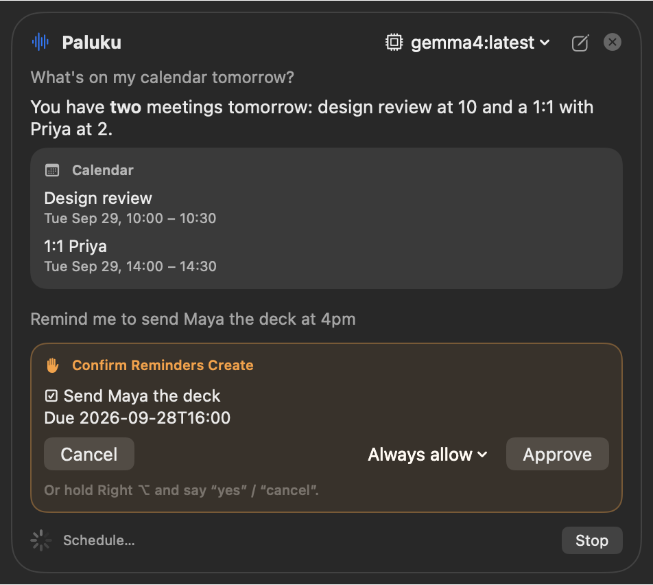
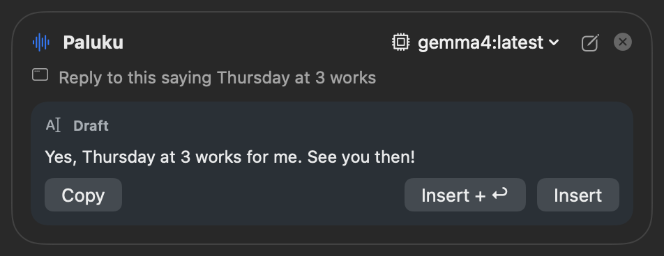
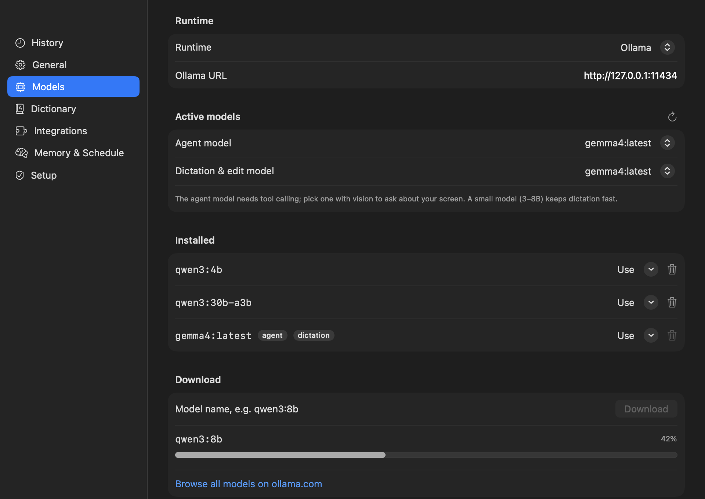

# Paluku

**A voice assistant for the Mac.** It runs fully on your machine and uses only free, open-source models. You can talk instead of typing, and have your voice do things across your apps.

*Paluku* (పలుకు) is Telugu for "to speak".

Paluku is open source (MIT). It needs no account, subscription or cloud service: your voice and your data stay on your Mac.

**Website:** [gvsrusa.github.io/paluku](https://gvsrusa.github.io/paluku/) · **Download:** [latest release](https://github.com/gvsrusa/paluku/releases/latest) · **Support:** [♥ Sponsor](https://github.com/sponsors/gvsrusa)

<p align="center">
  
  
</p>
<p align="center">
  
</p>

| Mode | How | What happens |
|---|---|---|
| **Dictation** | Hold **fn**, speak, release. Double-tap fn for hands-free. | Clean text is typed where your cursor is. Filler words and false starts are removed, and self-corrections are applied. |
| **Edit** | Select text, hold **fn**, say "make this shorter". | The selection is rewritten in place. |
| **Agent** | Hold **Right ⌥** and ask. Move the mouse to point at something. | It answers out loud and acts in Calendar, Reminders, Finder, Notes, Mail, Messages, Music/Spotify, Maps, web and weather, scheduled tasks, Claude Code/Codex, and any MCP server (Gmail, Google Calendar, Drive, Notion…). Anything that sends, creates or deletes asks you first. |

Everything stays on your Mac: speech-to-text runs in [WhisperKit](https://github.com/argmaxinc/WhisperKit), and the language model runs in [Ollama](https://ollama.com) (default **gemma4**). You can also use LM Studio, llama.cpp, MLX, Jan or vLLM. Audio is never stored. See [docs/PRIVACY.md](docs/PRIVACY.md).

---

## Install (users)

1. Install **Ollama**: download it from [ollama.com/download](https://ollama.com/download), then run `ollama pull gemma4`.
2. [**Download Paluku.dmg**](https://github.com/gvsrusa/paluku/releases/latest/download/Paluku.dmg) (latest release; older ones are on [Releases](https://github.com/gvsrusa/paluku/releases)). Open it and drag **Paluku** to **Applications**.
   - If the release note says *unsigned build*, macOS blocks the first launch. Either run `xattr -dr com.apple.quarantine /Applications/Paluku.app`, or open it once, then click **Open Anyway** in System Settings › Privacy & Security.
   - Or with **Homebrew**: `brew tap gvsrusa/paluku https://github.com/gvsrusa/paluku && brew install --cask paluku` (updates with `brew upgrade --cask paluku`).
3. Launch Paluku. It lives in the menu bar (waveform icon). The **Setup** tab walks you through the permissions: Microphone, Accessibility, Screen Recording, Calendars, Reminders and Contacts. The speech model (~630 MB) downloads on first launch.
4. Recommended: set System Settings › Keyboard › **Press 🌐 key to → Do Nothing**, so holding fn doesn't open the emoji picker.

Requirements: macOS 15 or later on Apple Silicon (M1+). 16 GB RAM or more is recommended for gemma4; use a smaller model on 8 GB machines.

### Change the model

- **Quick switch:** menu bar › model menu, or the model button at the top of the agent panel.
- **Models tab** (Open Paluku… › Models):
  - Pick separate models for the agent and for dictation.
  - Download models with a progress bar, or delete ones you don't need.
  - Switch the runtime to an **OpenAI-compatible server** (LM Studio, llama.cpp, MLX-LM, Jan, vLLM) by entering its URL.

See [docs/MODELS.md](docs/MODELS.md) for recommendations by Mac.

### Connect Gmail / Google Calendar / Drive

1. Go to Integrations › Google Workspace › Edit.
2. Paste an OAuth *Desktop app* client ID and secret from console.cloud.google.com, with the Gmail, Calendar and Drive APIs enabled. They are stored in the Keychain.
3. Enable the integration and ask something. Your browser opens once for consent.
4. Optional: in Edit, turn on **Trust this server's read-only labels** so reads such as searching mail skip the confirmation card. Anything that sends or changes still asks.

Any other [MCP server](https://modelcontextprotocol.io) works the same way: add it with a command or a URL.

---

## Develop

```bash
brew install xcodegen                 # once
git clone https://github.com/gvsrusa/paluku && cd paluku
scripts/build.sh Debug                # generate Paluku.xcodeproj and build
open build/dd/Build/Products/Debug/Paluku.app
```

| Command | What it does |
|---|---|
| `scripts/lint.sh` | swift-format check (fix with `swift format format -i -r App Packages/PalukuCore`) |
| `scripts/test.sh` | Unit tests, including security abuse cases (no network needed) |
| `PALUKU_LIVE=1 swift test --package-path Packages/PalukuCore --filter Live` | Real Ollama, Whisper and MCP integration tests |
| `PALUKU_LIVE=1 PALUKU_PERF=1 swift test --package-path Packages/PalukuCore --filter Perf` | Latency budget checks |
| `PALUKU_LIVE=1 PALUKU_BENCH=1 swift test --package-path Packages/PalukuCore --filter Benchmark` | Model tool-calling benchmark |
| `scripts/build.sh Release` | Release build |
| `scripts/install.sh` | Build Release and install to /Applications |
| `scripts/package.sh` | Signed and notarized DMG in `dist/` (when Apple credentials are set) |
| `scripts/release.sh 1.2.0 --push` | Bump the version, stamp the CHANGELOG, tag, and push. CI publishes the release. |
| `open -a Paluku --args --update` | Install the latest release in place and relaunch (same as the menu item) |
| `scripts/screenshots.sh` | Regenerate the screenshots in `site/screenshots` (demo data, dark + light; never reads your own data) |

- **Layout:** all logic lives in `Packages/PalukuCore` (a Swift package, unit-tested), and `App/` is a thin SwiftUI/AppKit shell. See [docs/ARCHITECTURE.md](docs/ARCHITECTURE.md).
- **Decisions** are recorded in [docs/decisions](docs/decisions).
- **Releasing:** [docs/RELEASING.md](docs/RELEASING.md).
- **Contributing:** [CONTRIBUTING.md](CONTRIBUTING.md).
- **Security model:** [docs/SECURITY.md](docs/SECURITY.md).

## Why not the Mac App Store?

The App Store requires the App Sandbox. The sandbox forbids typing into other apps, global key monitoring, AppleScript control of Mail and Messages, and launching MCP servers, which is everything Paluku does. Paluku is distributed as a Developer ID–signed, notarized DMG instead ([ADR-0001](docs/decisions/0001-distribute-as-notarized-dmg-not-mac-app-store.md)).

## Support Paluku

Paluku is free and open source. If it saves you typing, [sponsoring on GitHub](https://github.com/sponsors/gvsrusa) helps pay for the Apple Developer ID that lets releases open without Gatekeeper warnings, and for time on new integrations. Starring the repo helps others find it.

## License

MIT, see [LICENSE](LICENSE).
